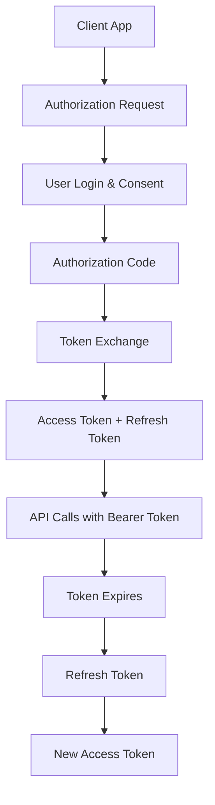

# OAuth2 Auth Pro WP REST API

> **Secure OAuth2 authentication for headless WordPress, SPAs, and mobile apps. No bloat, no upselling.**

OAuth2 server implementation for WordPress REST API with PKCE support, scope-based permissions, and refresh token rotation. Built for developers creating headless WordPress sites, mobile apps, and single-page applications.

## Features

### OAuth2 Implementation
- **Complete OAuth2 Flow** - Full Authorization Code flow
- **PKCE Support** - Proof Key for Code Exchange (RFC 7636) for public clients
- **Multi-Client Support** - Manage multiple OAuth2 applications
- **Token Management** - Access tokens and refresh tokens
- **Refresh Token Rotation** - Enhanced security with automatic rotation
- **Client Management** - Full CRUD operations for OAuth2 clients
- **Login Page** - Built-in authorization page for user consent
- **Redirect to Source App** - Seamless callback handling

### Security Features
- **CORS Management** - Configurable cross-origin policies
- **IP & User Agent Tracking** - Comprehensive security logging
- **Token Revocation** - Immediate token invalidation
- **Secure Token Storage** - Database-backed token management

### Management
- **Admin Interface** - Comprehensive client and settings management
- **Real-time Testing** - Built-in OAuth2 flow testing
- **Debugging Tools** - Detailed logging and diagnostics

## Quick Start

### 1. Install & Activate
1. Upload the plugin to `/wp-content/plugins/`
2. Activate through WordPress admin
3. Go to Settings → WP REST Auth OAuth2

### 2. Create OAuth2 Client
1. Navigate to the "OAuth2 Clients" tab
2. Click "Add New Client"
3. Configure:
   - **Client ID**: Unique identifier (e.g., `my-app`)
   - **Client Name**: Human-readable name
   - **Redirect URIs**: Authorized callback URLs

### 3. Start Integration
```javascript
// Step 1: Redirect to authorization endpoint
const authUrl = `https://your-site.com/wp-json/oauth2/v1/authorize?` +
    `client_id=your-client-id&` +
    `redirect_uri=https://your-app.com/callback&` +
    `response_type=code&` +
    `scope=read write&` +
    `state=random-state-string`;

window.location.href = authUrl;

// Step 2: Handle callback (at your redirect URI)
const urlParams = new URLSearchParams(window.location.search);
const authCode = urlParams.get('code');

// Step 3: Exchange code for tokens
const tokenResponse = await fetch('https://your-site.com/wp-json/oauth2/v1/token', {
    method: 'POST',
    headers: { 'Content-Type': 'application/json' },
    body: JSON.stringify({
        grant_type: 'authorization_code',
        client_id: 'your-client-id',
        client_secret: 'your-client-secret',
        code: authCode,
        redirect_uri: 'https://your-app.com/callback'
    })
});

const tokens = await tokenResponse.json();
// Store tokens securely...
```

## OAuth2 Endpoints

### Authorization Flow
| Method | Endpoint | Description |
|--------|----------|-------------|
| `GET` | `/wp-json/oauth2/v1/authorize` | Authorization endpoint (login page) |
| `POST` | `/wp-json/oauth2/v1/token` | Token exchange endpoint |
| `POST` | `/wp-json/oauth2/v1/refresh` | Refresh token endpoint |
| `POST` | `/wp-json/oauth2/v1/revoke` | Token revocation endpoint |

### Utility Endpoints
| Method | Endpoint | Description |
|--------|----------|-------------|
| `GET` | `/wp-json/oauth2/v1/userinfo` | Get current user info |
| `GET` | `/wp-json/oauth2/v1/scopes` | List available scopes |

## Available Scopes

| Scope | Description | Required Capability |
|-------|-------------|-------------------|
| `read` | View posts, pages, and profile | `read` |
| `write` | Create and edit content | `edit_posts` |
| `delete` | Delete posts and pages | `delete_posts` |
| `upload_files` | Upload and manage media | `upload_files` |
| `manage_users` | View and manage users | `list_users` |
| `manage_categories` | Manage categories and tags | `manage_categories` |
| `moderate_comments` | Moderate comments | `moderate_comments` |
| `edit_theme` | Modify theme settings | `edit_theme_options` |
| `manage_plugins` | Manage plugins | `activate_plugins` |
| `manage_options` | Site settings access | `manage_options` |

## Complete OAuth2 Flow



## PKCE Support (For Mobile & SPA Apps)

PKCE (Proof Key for Code Exchange) adds security for public clients that cannot securely store a client secret. This is essential for mobile apps and single-page applications.

### How PKCE Works

1. Client generates a random `code_verifier` (43-128 characters)
2. Client creates a `code_challenge` by hashing the verifier
3. Authorization request includes the challenge
4. Token request includes the verifier for validation

### JavaScript/TypeScript Example

```javascript
// Step 1: Generate code verifier and challenge
function generateCodeVerifier() {
    const array = new Uint8Array(32);
    crypto.getRandomValues(array);
    return base64UrlEncode(array);
}

function base64UrlEncode(buffer) {
    return btoa(String.fromCharCode(...buffer))
        .replace(/\+/g, '-')
        .replace(/\//g, '_')
        .replace(/=/g, '');
}

async function generateCodeChallenge(verifier) {
    const encoder = new TextEncoder();
    const data = encoder.encode(verifier);
    const hash = await crypto.subtle.digest('SHA-256', data);
    return base64UrlEncode(new Uint8Array(hash));
}

// Generate PKCE parameters
const codeVerifier = generateCodeVerifier();
const codeChallenge = await generateCodeChallenge(codeVerifier);

// Store verifier for later use
sessionStorage.setItem('code_verifier', codeVerifier);

// Step 2: Authorization request with PKCE
const authUrl = `https://your-site.com/wp-json/oauth2/v1/authorize?` +
    `client_id=your-client-id&` +
    `redirect_uri=https://your-app.com/callback&` +
    `response_type=code&` +
    `scope=read write&` +
    `state=random-state-string&` +
    `code_challenge=${codeChallenge}&` +
    `code_challenge_method=S256`;

window.location.href = authUrl;

// Step 3: Handle callback and exchange code
const urlParams = new URLSearchParams(window.location.search);
const authCode = urlParams.get('code');
const storedVerifier = sessionStorage.getItem('code_verifier');

// Step 4: Exchange code for tokens (no client_secret needed!)
const tokenResponse = await fetch('https://your-site.com/wp-json/oauth2/v1/token', {
    method: 'POST',
    headers: { 'Content-Type': 'application/json' },
    body: JSON.stringify({
        grant_type: 'authorization_code',
        client_id: 'your-client-id',
        code: authCode,
        redirect_uri: 'https://your-app.com/callback',
        code_verifier: storedVerifier  // Proves we started the flow
    })
});

const tokens = await tokenResponse.json();
// Success! Access token received without exposing client_secret
```

### PHP Example (Server-Side)

```php
// Generate code verifier
function generateCodeVerifier() {
    return rtrim(strtr(base64_encode(random_bytes(32)), '+/', '-_'), '=');
}

// Generate code challenge
function generateCodeChallenge($verifier) {
    $hash = hash('sha256', $verifier, true);
    return rtrim(strtr(base64_encode($hash), '+/', '-_'), '=');
}

// Step 1: Create PKCE parameters
$codeVerifier = generateCodeVerifier();
$codeChallenge = generateCodeChallenge($codeVerifier);

// Store verifier in session
$_SESSION['oauth_code_verifier'] = $codeVerifier;

// Step 2: Build authorization URL
$authUrl = 'https://your-site.com/wp-json/oauth2/v1/authorize?' . http_build_query([
    'client_id' => 'your-client-id',
    'redirect_uri' => 'https://your-app.com/callback',
    'response_type' => 'code',
    'scope' => 'read write',
    'state' => bin2hex(random_bytes(16)),
    'code_challenge' => $codeChallenge,
    'code_challenge_method' => 'S256'
]);

// Redirect user
header('Location: ' . $authUrl);
exit;

// Step 3: Handle callback (at redirect_uri)
$authCode = $_GET['code'];
$codeVerifier = $_SESSION['oauth_code_verifier'];

// Step 4: Exchange for tokens
$response = wp_remote_post('https://your-site.com/wp-json/oauth2/v1/token', [
    'body' => [
        'grant_type' => 'authorization_code',
        'client_id' => 'your-client-id',
        'code' => $authCode,
        'redirect_uri' => 'https://your-app.com/callback',
        'code_verifier' => $codeVerifier
    ]
]);

$tokens = json_decode(wp_remote_retrieve_body($response), true);
// Access token received!
```

### PKCE vs Traditional Flow

| Feature | Traditional Flow | PKCE Flow |
|---------|-----------------|-----------|
| **Client Secret** | Required | Not required |
| **Best For** | Server-side apps | Mobile apps, SPAs |
| **Security** | Secret must be stored | No secret to steal |
| **Complexity** | Simple | Slightly more complex |
| **Standard** | OAuth 2.0 | RFC 7636 |

### When to Use PKCE

✅ **Use PKCE for:**
- Mobile applications (iOS, Android, React Native)
- Single Page Applications (React, Vue, Angular)
- Desktop applications
- Any client that cannot securely store a secret

❌ **Traditional flow for:**
- Server-to-server integrations
- Backend applications with secure storage
- Trusted environments

## Configuration

### Environment Variables (Production)
```php
// wp-config.php
define('WP_OAUTH2_SECRET', 'your-oauth2-secret-key');
```

### Admin Configuration
Navigate to **Settings → WP REST Auth OAuth2**:

#### General Settings
- CORS allowed origins
- Debug logging
- Security headers

#### OAuth2 Clients
- Client ID and secret management
- Redirect URI configuration
- Client-specific settings

## Testing Your Integration

### Built-in Test Client
The plugin includes a demo client for testing:
- **Client ID**: `demo-client`
- **Client Secret**: `demo-secret`
- **Redirect URIs**: Preconfigured for common development URLs

### cURL Examples
```bash
# Get authorization (redirect in browser)
curl "https://your-site.com/wp-json/oauth2/v1/authorize?client_id=demo-client&redirect_uri=http://localhost:3000/callback&response_type=code&scope=read+write"

# Exchange code for tokens
curl -X POST "https://your-site.com/wp-json/oauth2/v1/token" \
  -H "Content-Type: application/json" \
  -d '{
    "grant_type": "authorization_code",
    "client_id": "demo-client",
    "client_secret": "demo-secret",
    "code": "your-auth-code",
    "redirect_uri": "http://localhost:3000/callback"
  }'

# Make authenticated request
curl "https://your-site.com/wp-json/wp/v2/posts" \
  -H "Authorization: Bearer your-access-token"

# Refresh token
curl -X POST "https://your-site.com/wp-json/oauth2/v1/refresh" \
  -H "Content-Type: application/json" \
  -d '{
    "grant_type": "refresh_token",
    "refresh_token": "your-refresh-token"
  }'
```

## Use Cases

- **Headless WordPress** - Secure authentication for decoupled frontends
- **Mobile Applications** - Native iOS/Android app authentication with PKCE
- **Single Page Applications** - React, Vue, Angular authentication
- **Third-party Integrations** - Secure API access for external services
- **Microservices** - Service-to-service authentication

## Why Choose OAuth2 Auth Pro?

✅ **PKCE Support** - Secure authentication for public clients without storing secrets
✅ **Scope-Based Permissions** - Automatic endpoint enforcement with WordPress capabilities
✅ **Clean Code** - Modern, tested, maintainable codebase
✅ **Zero Bloat** - No premium upselling, no unnecessary features
✅ **Security-First** - Token hashing, rotation, timing-safe comparisons
✅ **Developer-Friendly** - Clear errors, comprehensive docs, test suite included

**Part of the "Auth Pro WP REST API" family:**
- [JWT Auth Pro WP REST API - Secure Refresh Tokens](https://github.com/juanma-wp/jwt-auth-pro-wp-rest-api)
- OAuth2 Auth Pro WP REST API

## Monitoring & Debugging

### Debug Logging
Enable debug logging to monitor OAuth2 flows:
1. Enable WP_DEBUG in wp-config.php
2. Enable debug logging in plugin settings
3. Check `/wp-content/debug.log` for OAuth2 events

### Token Management
- View active tokens in admin interface
- Monitor token usage and expiration
- Bulk revoke tokens for security incidents

### Security Monitoring
- Track failed authorization attempts
- Monitor refresh token usage
- Log client authentication failures

## Requirements

- WordPress 5.6+
- PHP 7.4+
- HTTPS (required for production OAuth2)
- Modern browser support for admin interface

## Testing

Run comprehensive tests:

```bash
# Unit tests
composer test

# Integration tests
composer test-integration

# OAuth2 flow tests
composer test-oauth2
```

## License

GPL v2 or later

## Contributing

Contributions welcome! Please:
1. Follow WordPress coding standards
2. Include comprehensive tests
3. Update documentation
4. Consider security implications

## Support

- **Issues:** [GitHub Issues](https://github.com/juanma-wp/wp-rest-auth-oauth2/issues)
- **Documentation:** This README
- **Sibling Plugin:** [JWT Auth Pro WP REST API](https://github.com/juanma-wp/jwt-auth-pro-wp-rest-api)

## Credits

Created and maintained by [Juan Manuel Garrido](https://github.com/juanma-wp)

---

**Part of the Auth Pro WP REST API family - Professional authentication solutions for WordPress** 🔒
