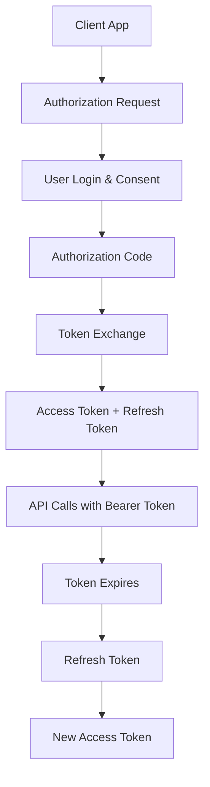

# WP REST Auth OAuth2

OAuth2 authentication for WordPress REST API with complete Authorization Code flow, token management, and multi-client support.

## Features

### OAuth2 Implementation
- **Complete OAuth2 Flow** - Full Authorization Code flow
- **Multi-Client Support** - Manage multiple OAuth2 applications
- **Token Management** - Access tokens and refresh tokens
- **Refresh Token Rotation** - Enhanced security with automatic rotation
- **Client Management** - Full CRUD operations for OAuth2 clients
- **Login Page** - Built-in authorization page for user consent
- **Redirect to Source App** - Seamless callback handling

### Security Features
- **CORS Management** - Configurable cross-origin policies
- **IP & User Agent Tracking** - Comprehensive security logging
- **Token Revocation** - Immediate token invalidation
- **Secure Token Storage** - Database-backed token management

### Management
- **Admin Interface** - Comprehensive client and settings management
- **Real-time Testing** - Built-in OAuth2 flow testing
- **Debugging Tools** - Detailed logging and diagnostics

## Quick Start

### 1. Install & Activate
1. Upload the plugin to `/wp-content/plugins/`
2. Activate through WordPress admin
3. Go to Settings → WP REST Auth OAuth2

### 2. Create OAuth2 Client
1. Navigate to the "OAuth2 Clients" tab
2. Click "Add New Client"
3. Configure:
   - **Client ID**: Unique identifier (e.g., `my-app`)
   - **Client Name**: Human-readable name
   - **Redirect URIs**: Authorized callback URLs

### 3. Start Integration
```javascript
// Step 1: Redirect to authorization endpoint
const authUrl = `https://your-site.com/wp-json/oauth2/v1/authorize?` +
    `client_id=your-client-id&` +
    `redirect_uri=https://your-app.com/callback&` +
    `response_type=code&` +
    `scope=read write&` +
    `state=random-state-string`;

window.location.href = authUrl;

// Step 2: Handle callback (at your redirect URI)
const urlParams = new URLSearchParams(window.location.search);
const authCode = urlParams.get('code');

// Step 3: Exchange code for tokens
const tokenResponse = await fetch('https://your-site.com/wp-json/oauth2/v1/token', {
    method: 'POST',
    headers: { 'Content-Type': 'application/json' },
    body: JSON.stringify({
        grant_type: 'authorization_code',
        client_id: 'your-client-id',
        client_secret: 'your-client-secret',
        code: authCode,
        redirect_uri: 'https://your-app.com/callback'
    })
});

const tokens = await tokenResponse.json();
// Store tokens securely...
```

## OAuth2 Endpoints

### Authorization Flow
| Method | Endpoint | Description |
|--------|----------|-------------|
| `GET` | `/wp-json/oauth2/v1/authorize` | Authorization endpoint (login page) |
| `POST` | `/wp-json/oauth2/v1/token` | Token exchange endpoint |
| `POST` | `/wp-json/oauth2/v1/refresh` | Refresh token endpoint |
| `POST` | `/wp-json/oauth2/v1/revoke` | Token revocation endpoint |

### Utility Endpoints
| Method | Endpoint | Description |
|--------|----------|-------------|
| `GET` | `/wp-json/oauth2/v1/userinfo` | Get current user info |
| `GET` | `/wp-json/oauth2/v1/scopes` | List available scopes |

## Available Scopes

| Scope | Description | Required Capability |
|-------|-------------|-------------------|
| `read` | View posts, pages, and profile | `read` |
| `write` | Create and edit content | `edit_posts` |
| `delete` | Delete posts and pages | `delete_posts` |
| `upload_files` | Upload and manage media | `upload_files` |
| `manage_users` | View and manage users | `list_users` |
| `manage_categories` | Manage categories and tags | `manage_categories` |
| `moderate_comments` | Moderate comments | `moderate_comments` |
| `edit_theme` | Modify theme settings | `edit_theme_options` |
| `manage_plugins` | Manage plugins | `activate_plugins` |
| `manage_options` | Site settings access | `manage_options` |

## Complete OAuth2 Flow



## Configuration

### Environment Variables (Production)
```php
// wp-config.php
define('WP_OAUTH2_SECRET', 'your-oauth2-secret-key');
```

### Admin Configuration
Navigate to **Settings → WP REST Auth OAuth2**:

#### General Settings
- CORS allowed origins
- Debug logging
- Security headers

#### OAuth2 Clients
- Client ID and secret management
- Redirect URI configuration
- Client-specific settings

## Testing Your Integration

### Built-in Test Client
The plugin includes a demo client for testing:
- **Client ID**: `demo-client`
- **Client Secret**: `demo-secret`
- **Redirect URIs**: Preconfigured for common development URLs

### cURL Examples
```bash
# Get authorization (redirect in browser)
curl "https://your-site.com/wp-json/oauth2/v1/authorize?client_id=demo-client&redirect_uri=http://localhost:3000/callback&response_type=code&scope=read+write"

# Exchange code for tokens
curl -X POST "https://your-site.com/wp-json/oauth2/v1/token" \
  -H "Content-Type: application/json" \
  -d '{
    "grant_type": "authorization_code",
    "client_id": "demo-client",
    "client_secret": "demo-secret",
    "code": "your-auth-code",
    "redirect_uri": "http://localhost:3000/callback"
  }'

# Make authenticated request
curl "https://your-site.com/wp-json/wp/v2/posts" \
  -H "Authorization: Bearer your-access-token"

# Refresh token
curl -X POST "https://your-site.com/wp-json/oauth2/v1/refresh" \
  -H "Content-Type: application/json" \
  -d '{
    "grant_type": "refresh_token",
    "refresh_token": "your-refresh-token"
  }'
```

## Use Cases

- **Third-party Integrations** - Secure API access for external services
- **Mobile Applications** - Native app authentication
- **SPA Applications** - Single-page app authentication
- **Microservices** - Service-to-service authentication

## Monitoring & Debugging

### Debug Logging
Enable debug logging to monitor OAuth2 flows:
1. Enable WP_DEBUG in wp-config.php
2. Enable debug logging in plugin settings
3. Check `/wp-content/debug.log` for OAuth2 events

### Token Management
- View active tokens in admin interface
- Monitor token usage and expiration
- Bulk revoke tokens for security incidents

### Security Monitoring
- Track failed authorization attempts
- Monitor refresh token usage
- Log client authentication failures

## Requirements

- WordPress 5.6+
- PHP 7.4+
- HTTPS (required for production OAuth2)
- Modern browser support for admin interface

## Testing

Run comprehensive tests:

```bash
# Unit tests
composer test

# Integration tests
composer test-integration

# OAuth2 flow tests
composer test-oauth2
```

## License

GPL v2 or later

## Contributing

Contributions welcome! Please:
1. Follow WordPress coding standards
2. Include comprehensive tests
3. Update documentation
4. Consider security implications

---

**Secure. Simple. OAuth2.** 🔒
