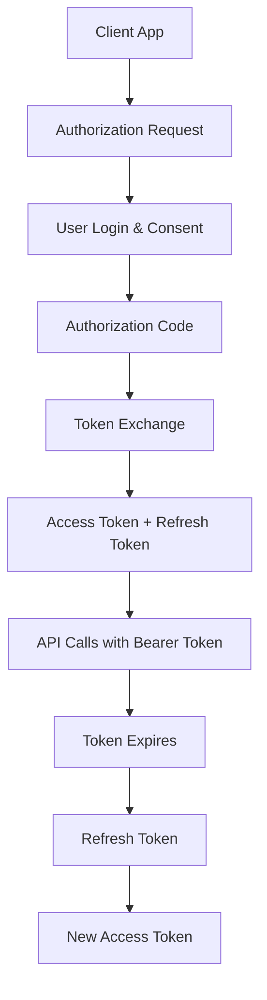

# WP REST Auth OAuth2

🚀 **Enterprise-grade OAuth2 authentication with API Proxy security for WordPress REST API**

Complete OAuth2 Authorization Code flow implementation with advanced security features including API Proxy pattern, scoped permissions, and multi-client management. Perfect for third-party integrations and enterprise applications.

## ✨ Features

### 🔐 OAuth2 Implementation
- **Complete OAuth2 Flow** - Full Authorization Code flow with PKCE
- **Multi-Client Support** - Manage multiple OAuth2 applications
- **Scoped Permissions** - Granular access control with predefined scopes
- **Refresh Token Rotation** - Enhanced security with automatic rotation
- **Client Management** - Full CRUD operations for OAuth2 clients

### 🛡️ Security Features
- **API Proxy Pattern** - Backend-only token storage (recommended by OAuth2 Security BCP)
- **HTTPOnly Session Cookies** - Secure session management
- **CORS Management** - Configurable cross-origin policies
- **IP & User Agent Tracking** - Comprehensive security logging
- **Token Revocation** - Immediate token invalidation

### ⚙️ Management
- **Enterprise Admin Interface** - Comprehensive client and settings management
- **Three Proxy Modes** - Full, Selective, and External-only proxying
- **Real-time Testing** - Built-in OAuth2 flow testing
- **Debugging Tools** - Detailed logging and diagnostics

## 🚀 Quick Start

### 1. Install & Activate
1. Upload the plugin to `/wp-content/plugins/`
2. Activate through WordPress admin
3. Go to Settings → WP REST Auth OAuth2

### 2. Create OAuth2 Client
1. Navigate to the "OAuth2 Clients" tab
2. Click "Add New Client"
3. Configure:
   - **Client ID**: Unique identifier (e.g., `my-app`)
   - **Client Name**: Human-readable name
   - **Redirect URIs**: Authorized callback URLs

### 3. Configure API Proxy (Recommended)
1. Go to "Proxy Settings" tab
2. Enable API Proxy
3. Choose proxy mode:
   - **Full**: All API calls proxied (maximum security)
   - **Selective**: Only authenticated endpoints
   - **External-only**: Only third-party requests

### 4. Start Integration
```javascript
// Step 1: Redirect to authorization endpoint
const authUrl = `https://your-site.com/wp-json/oauth2/v1/authorize?` +
    `client_id=your-client-id&` +
    `redirect_uri=https://your-app.com/callback&` +
    `response_type=code&` +
    `scope=read write&` +
    `state=random-state-string`;

window.location.href = authUrl;

// Step 2: Handle callback (at your redirect URI)
const urlParams = new URLSearchParams(window.location.search);
const authCode = urlParams.get('code');

// Step 3: Exchange code for tokens
const tokenResponse = await fetch('https://your-site.com/wp-json/oauth2/v1/token', {
    method: 'POST',
    headers: { 'Content-Type': 'application/json' },
    body: JSON.stringify({
        grant_type: 'authorization_code',
        client_id: 'your-client-id',
        client_secret: 'your-client-secret',
        code: authCode,
        redirect_uri: 'https://your-app.com/callback'
    })
});

const tokens = await tokenResponse.json();
// Store tokens securely...
```

## 📍 OAuth2 Endpoints

### Authorization Flow
| Method | Endpoint | Description |
|--------|----------|-------------|
| `GET` | `/wp-json/oauth2/v1/authorize` | Authorization endpoint |
| `POST` | `/wp-json/oauth2/v1/token` | Token exchange endpoint |
| `POST` | `/wp-json/oauth2/v1/refresh` | Refresh token endpoint |
| `POST` | `/wp-json/oauth2/v1/revoke` | Token revocation endpoint |

### API Proxy Endpoints (When Enabled)
| Method | Endpoint | Description |
|--------|----------|-------------|
| `GET` | `/wp-json/proxy/v1/login` | Initiate proxy session |
| `POST` | `/wp-json/proxy/v1/logout` | End proxy session |
| `*` | `/wp-json/proxy/v1/api/*` | Proxied API calls |

### Utility Endpoints
| Method | Endpoint | Description |
|--------|----------|-------------|
| `GET` | `/wp-json/oauth2/v1/userinfo` | Get current user info |
| `GET` | `/wp-json/oauth2/v1/scopes` | List available scopes |

## 🔒 Available Scopes

| Scope | Description | Required Capability |
|-------|-------------|-------------------|
| `read` | View posts, pages, and profile | `read` |
| `write` | Create and edit content | `edit_posts` |
| `delete` | Delete posts and pages | `delete_posts` |
| `upload_files` | Upload and manage media | `upload_files` |
| `manage_users` | View and manage users | `list_users` |
| `manage_categories` | Manage categories and tags | `manage_categories` |
| `moderate_comments` | Moderate comments | `moderate_comments` |
| `edit_theme` | Modify theme settings | `edit_theme_options` |
| `manage_plugins` | Manage plugins | `activate_plugins` |
| `manage_options` | Site settings access | `manage_options` |
| `view_stats` | Access analytics | `view_query_monitor` |

## 🛡️ API Proxy Security

The API Proxy pattern provides maximum security by keeping OAuth2 tokens on the backend only, following [OAuth2 Security Best Current Practice for Browser-Based Apps](https://datatracker.ietf.org/doc/html/draft-ietf-oauth-security-topics).

### Benefits
- ✅ **No tokens in JavaScript** - Immune to XSS attacks
- ✅ **HTTPOnly session cookies** - Secure session management
- ✅ **Backend token validation** - All tokens validated server-side
- ✅ **Automatic token refresh** - Transparent to client applications
- ✅ **CORS protection** - Configurable origin restrictions

### Proxy Flow
```javascript
// 1. Start proxy session (redirects to OAuth2 flow)
window.location.href = '/wp-json/proxy/v1/login?client_id=your-app';

// 2. After OAuth2 completion, make proxied API calls
const response = await fetch('/wp-json/proxy/v1/api/wp/v2/posts', {
    credentials: 'include' // Includes session cookie
});

// 3. End session when done
await fetch('/wp-json/proxy/v1/logout', {
    method: 'POST',
    credentials: 'include'
});
```

## 🔄 Complete OAuth2 Flow



## ⚙️ Configuration

### Environment Variables (Production)
```php
// wp-config.php
define('WP_OAUTH2_SECRET', 'your-oauth2-secret-key');
```

### Admin Configuration
Navigate to **Settings → WP REST Auth OAuth2**:

#### General Settings
- CORS allowed origins
- Debug logging
- Security headers

#### OAuth2 Clients
- Client ID and secret management
- Redirect URI configuration
- Client-specific settings

#### API Proxy Settings
- Enable/disable proxy
- Proxy mode selection
- Session configuration

## 🧪 Testing Your Integration

### Built-in Test Client
The plugin includes a demo client for testing:
- **Client ID**: `demo-client`
- **Client Secret**: `demo-secret`
- **Redirect URIs**: Preconfigured for common development URLs

### Manual Testing
1. Use the authorization URL to start the flow
2. Complete user consent
3. Exchange authorization code for tokens
4. Make authenticated API calls
5. Test refresh token functionality

### cURL Examples
```bash
# Get authorization (redirect in browser)
curl "https://your-site.com/wp-json/oauth2/v1/authorize?client_id=demo-client&redirect_uri=http://localhost:3000/callback&response_type=code&scope=read+write"

# Exchange code for tokens
curl -X POST "https://your-site.com/wp-json/oauth2/v1/token" \
  -H "Content-Type: application/json" \
  -d '{
    "grant_type": "authorization_code",
    "client_id": "demo-client",
    "client_secret": "demo-secret",
    "code": "your-auth-code",
    "redirect_uri": "http://localhost:3000/callback"
  }'

# Make authenticated request
curl "https://your-site.com/wp-json/wp/v2/posts" \
  -H "Authorization: Bearer your-access-token"

# Refresh token
curl -X POST "https://your-site.com/wp-json/oauth2/v1/refresh" \
  -H "Content-Type: application/json" \
  -d '{
    "grant_type": "refresh_token",
    "refresh_token": "your-refresh-token"
  }'
```

## 💡 Use Cases

### Enterprise Applications
- **Third-party Integrations** - Secure API access for external services
- **Mobile Applications** - Native app authentication
- **SaaS Platforms** - Multi-tenant authentication
- **Microservices** - Service-to-service authentication

### Security-Critical Environments
- **Financial Applications** - Banking and fintech integrations
- **Healthcare Systems** - HIPAA-compliant API access
- **Government Platforms** - High-security requirements
- **E-commerce** - Payment and order processing

## 🔧 Advanced Configuration

### Custom Scopes
```php
// Add custom scopes
add_filter('wp_auth_oauth2_available_scopes', function($scopes) {
    $scopes['custom_scope'] = 'Access to custom functionality';
    return $scopes;
});

// Define scope capabilities
add_filter('wp_auth_oauth2_scope_capabilities', function($capabilities) {
    $capabilities['custom_scope'] = 'custom_capability';
    return $capabilities;
});
```

### Client Validation
```php
// Custom client validation
add_filter('wp_auth_oauth2_validate_client', function($is_valid, $client_id, $client) {
    // Custom validation logic
    return $is_valid && custom_validation($client);
}, 10, 3);
```

### Proxy Customization
```php
// Custom proxy rules
add_filter('wp_auth_oauth2_proxy_routes', function($routes) {
    $routes[] = '/custom-api/*';
    return $routes;
});
```

## 🔍 Monitoring & Debugging

### Debug Logging
Enable debug logging to monitor OAuth2 flows:
1. Enable WP_DEBUG in wp-config.php
2. Enable debug logging in plugin settings
3. Check `/wp-content/debug.log` for OAuth2 events

### Token Management
- View active tokens in admin interface
- Monitor token usage and expiration
- Bulk revoke tokens for security incidents

### Security Monitoring
- Track failed authorization attempts
- Monitor refresh token usage
- Log client authentication failures

## 🆚 vs Simple JWT

| Feature | OAuth2 Plugin | JWT Plugin |
|---------|---------------|------------|
| **Complexity** | Enterprise-grade | Simple & focused |
| **Use Case** | Third-party apps | Direct API access |
| **Authorization** | Full OAuth2 flow | Direct login |
| **Client Management** | Multi-client support | Single application |
| **Scoped Permissions** | ✅ Granular scopes | ❌ User capabilities |
| **API Proxy** | ✅ Optional proxy | ❌ Direct API |
| **Admin Interface** | Comprehensive | Simple settings |

**Choose OAuth2 when:**
- Building third-party integrations
- Need granular permissions
- Require enterprise security
- Managing multiple applications

**Choose JWT when:**
- Building single application
- Need simple authentication
- Direct API access is sufficient
- Minimal configuration required

## 📝 Requirements

- WordPress 5.6+
- PHP 7.4+
- HTTPS (required for production OAuth2)
- Modern browser support for admin interface

## 🧪 Testing

Run comprehensive tests:

```bash
# Unit tests
composer test

# Integration tests
composer test-integration

# OAuth2 flow tests
composer test-oauth2

# API Proxy tests
composer test-proxy
```

## 📄 License

GPL v2 or later

## 🤝 Contributing

Enterprise-grade contributions welcome! Please:
1. Follow WordPress coding standards
2. Include comprehensive tests
3. Update documentation
4. Consider security implications

---

**Enterprise. Secure. OAuth2.** 🚀🔒